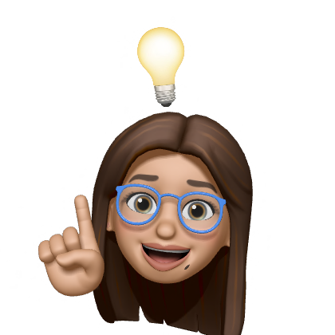

# A Portfolio Website: Rebecca Feltman

> Thank you for visiting! 😃

 

    This website is intended for anybody who might have any interest in using my services, getting in touch, or using it as a template to create your own. 

I am a junior software develepor in-the-making and I am very excited to be releasing my very own portfolio webpage! 

If you take a glance at the codes involved, you should see semanticly organized material in an easy to navigate format! If you see anything you'd improve, shoot me an email!

I am still learning the fundamental skills I will need to be able to fill any role, but my projected readiness date will be June 10, 2024. I am a honest and dedicated worker that is guaranteed to be an asset to any team I become a part of. On top of my exceptional interpersonal skills, I consider myself to also bring some comedic cheeriness to the table that will boost the morale of the team! 

> ##### The technologies used in this webpage are HTML and CSS. Below is what the webpage looks like from first glance:

 

> ###### This is what the webpage looks like on a mobile device:

#### Contributors:

* **Rebecca Feltman** 

    >Check me out on [GitHub](https://github.com/beckpull) or shoot me an [email](mailto:beckpull@icloud.com) if you have any website needs!